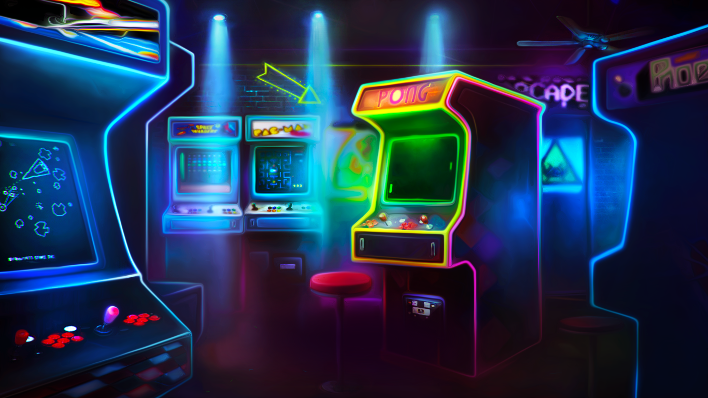

# Individual Project - Henry Videogames

 This is a final project made by <b>Daniel Abuaf</b> for Henry's bootcamp with the intention of putting together all the knowledge learnt in it in an SPA connecting a postgreSql DB through ExpressJS into our own designed React App. 

<b>Enjoy!</b>

## Instructions

### Server side
- Open a new terminal and go to the project's api sub-folder.
- Run **`<npm install>`** to install all dependencies.
- Run **`<npm start>`** to run the Node server.
- For more information, please refer to the api's Readme file

### Client side
- Open a new terminal and go to the project's client sub-folder.
- Run **`<npm install>`** to install all dependencies.
- Run **`<npm start>`** to run the React app.
- For more information, please refer to the client's Readme file
